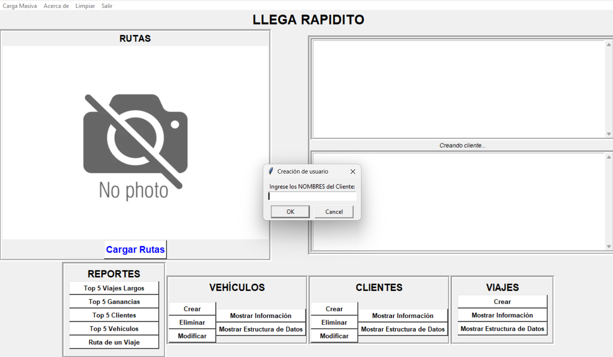

r# Manual de Usuario - Llega Rapidito
## Objetivos
### General
- Analizar exhaustivamente la arquitectura, el funcionamiento interno y la lógica algorítmica del programa de administración de viajes, con el propósito de ofrecer una comprensión completa de su diseño e implementación.
### Especificos
- Describir el flujo de control del programa, detallando la secuencia de ejecución de sus principales módulos.
- Documentar exhaustivamente cada una de las funcionalidades del programa, incluyendo su propósito, parámetros de entrada, valores de retorno y posibles errores.
## Introducción
El presente manual de usuarioo documenta el diseño y la implementación de un sistema informático para la administración de viajes, incluyendo la gestión de clientes, vehículos y rutas. El sistema facilita la organización y el seguimiento de viajes mediante la importación de datos desde archivos de carga masiva, así como la creación manual de registros de clientes y vehículos.Este manual tiene como propósito una comprensión profunda del funcionamiento interno del sistema. Se detallarán las funcionalidades del sistema y su flujo de ejecución.

Este programa es una herramienta que permite la administración ordenada de viajes con clientes y vehículos. Se ingresan archivos de carga masiva las rutas de los viajes, los clientes y los vehículos. Si se desea, se puede generar de forma manual para los clientes y los vehículos.

## Requisito del Sistema
- Poseer el ejecutable
- 1GB de memoria RAM
- Procesador con Arquitectura x86
- Compilador de python
- IDE o editor de texto compatible
- Pantalla
- Teclado (opcional)

## Flujo de las funcionalidades del programa

1. Para iniciar el programa, primeramente se abre desde un editor de texto, que en esta ocasión será Visual Studio Code.
   
2. Una vez que el programa ya se tiene abierto, se mostrará la siguiente ventana que contendrá cada una de las funcionalidades del programa. En la parte inferior se encuentran todas las acciones que se pueden realizar dentro del programa, en la barra de la parte superior, se pueden realizar las cargas masiva de los usuario y de los vehículos, se puede mostrar la información de este programa, limpiar todas las salidas y salir del programa. Comenzaremos explorando el modulos de *Cliente*
   
3. Si se hace click en la opción de *crear* se mostrará un menu que permitirá crear al usuario.
   
4.  Una vez se llena la información, se mostrará que ya se llenó correctamente la información solicitada.
   
5. Si se hace click en *Mostrar información*, en la parte superior se mostrarán todos los clientes.
   
6. Ahora si pulsamos la opción de *Modificar*, aparecerá una ventana que permitirá modificar la información de una de los clientes ingresando el DPI de este.
   
7. Una vez que se llena la información del usuario, mostrará que se llenó correctamente la nueva información del usuario.
   
8. Podemos verificar que se encuentra correcamtente modificada la información al pulsar *Mostrar información*
   
9. Ahora si se pulsa el botón *Eliminar*, se eliminará el cliente cuyo DPI sea ingresado.
   
10. Y dando click en la opción *Mostrar información* se puede observa en la parte superior derecha de la pantalla, que efectivamente se eliminó el cliente.
   
11. Para seguir, realizaremos un carga masiva de usuarios con la opción de la esquina superior izquierda de la pantalla
   
12. Una vez que se han cargado los datos, se podrá observar que pulsando el botón de *Mostrar información* 
   
13. Finalizando con la sección de clientes, se puede generar una grafo con la estructura que se utilizó para guardar la información de los usuario presionando, *Mostrar Estructura de Datos*, la cual abrirá en el navegador un pdf con este grafo.
   
14. Ahora iremos al modulo de *Vehículos*, el cual tiene las misma funcionalidades del usuario, por lo que realizaremos el mismo procedimiento previamente descrito comenzando por agregar un vehículo.

15. Mostrar la información de ese vehículo creado

16. Modificar la información de este vehículo creado

17. Mostrar que se modificó correctamente

18. Eliminar el vehículo creado
(no se creó la opción pero dejé el botón xd)
19. Cargar masivamente la información de los vehículos

20. Mostrar que funcionó la carga masiva

21. Y prestar la estructura de datos, la cual, para los vehículos, se utilizó el un arbol b

22. Ahora se observará la parte izquierda, en la cual se pueden cargar las rutas. Una vez cargadas, desaparecerá el botón y se mostrará el grafo que representará las rutas.

23. Una vez se tiene todo cargado de la manera en la que se mostró previamente, se puede proceder a crear viajes, en donde se solicitará todo lo necesario para la creación del viaje, lo cual sería el cliente, el vehículo y los dos lugares a los que se debería de ir.

24. Así como con todos los módulos anteriores, se tiene la opción de mostrar información, la cual mostrará la información de todos los viajes, que en esta ocasión sería unicamente uno.

25. Adicionalemente, también se mostrará la estructura de donde se guardó la información de los viajes mediante un pdf con un grafo creado con graphviz.

26. Ahora yendo a la sección de la Reportes, si se selecciona la opción de *Ruta de un Viaje*, se solicitará el id del viaje para mostrar paso por paso mediante un grafo de graphviz, los lugares por los que pasó el viaje.

27. Para continuar con los ejemplos, se ingresaron nuevos viajes de la misma manera en la que se mostró en este manual. Si se escoge la opción de *Top 5 Viajes Largos*, se creará una tabla en donde se encuentra el segundo campo de entrada de arriba para abajo en donde se presentarán los viajes que pasarón por la mayor cantidad de lugares.

28. Si se selecciona la opción de *Top 5 Ganancias*, se mostrarán los viajes que generaron más ganancias a partir del tiempo en que se demoró el viaje y costo de renta del vehículo

29. Con la opción *Top 5 Clientes* se mostrarán los 5 clientes con más viajes realizados, en esta ocasión, dado a que hay unicamente 4 clientes, serán los únicos que se mostrarán.

30. Por último, si se presiona la opción de *Top 5 vehículos*, se mostrarán los 5 vehículos más utilizados para los viajes. De la misma manera que previamente, se utilizaron unicamente 3 vehículos, por lo que solo se mostrarán esos 3

Con esto se finaliza el manual de usuario de **Llega Rapidito**, este manual esta hecho sobre una versión preliminar del programa, por lo que se pueden encontrar cambios en la versión final de la aplicación. Sin embargo, esta es la escencia del programa y todo lo que sea construido sobre esto, tendrá un flujo y funcionalidades casi iguales.

